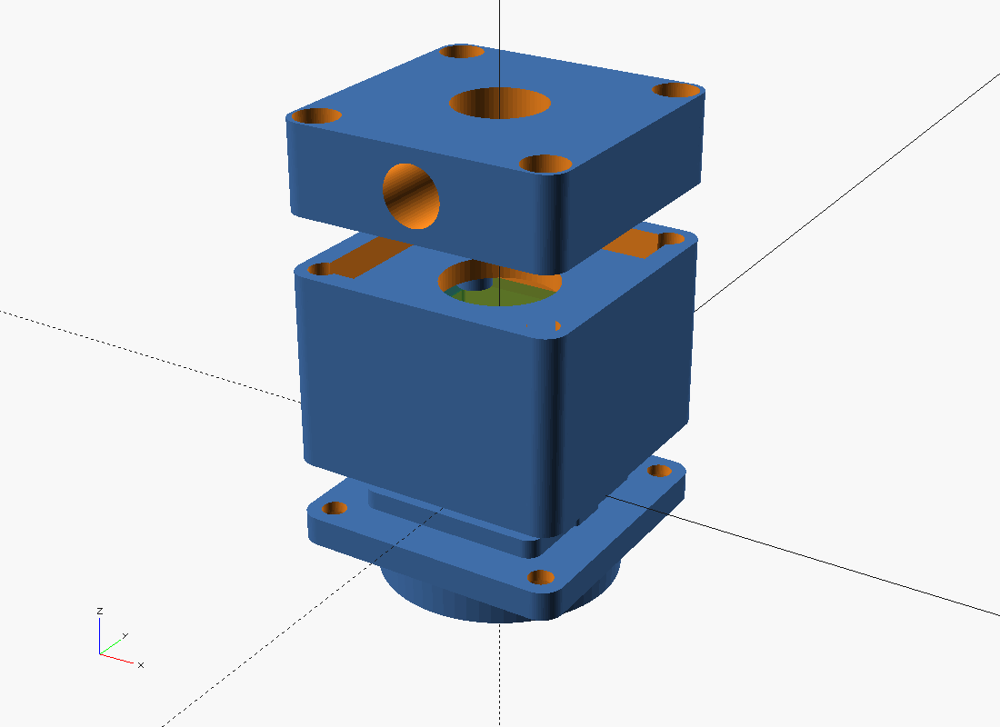

# M.A.P.S. — Modular Awesome Photonic System

**`mapscam`** is the camera-enclosure repository of the M.A.P.S. project: a **modular,
3D-printed enclosure system for board-level C-mount CMOS cameras**, for fixed and monitoring
installations. The housing is a short stack of independent printed modules — front (lens),
body, sensor carrier, rear (cabling) — on one shared mechanical interface, so each piece can
be reprinted or swapped as sensors and lenses change.

Parametric [OpenSCAD](https://openscad.org) source. Mechanical + docs only — no firmware.

> **Status: v0.1 scaffold.** The geometry renders, the flange-focal-distance math is
> enforced in code, and every variant passes `make check`. Nothing has been printed and
> fit-checked against hardware yet — treat dimensions as a starting point, not gospel.



## Quick start

```bash
git clone --recurse-submodules <this repo>
cd mapscam
brew install openscad          # or apt / your package manager
python3 --version              # 3.11+ (needed by tools/gen.py — stdlib only)
make check                     # regen check + render every component/part, fail on any warning
make                           # STLs + preview PNGs into stl/ and renders/
```

Render a single part:

```bash
OPENSCADPATH=vendor openscad -o stl/body.stl -D 'part="body"' scad/variants/generic_29mm_c.scad
```

Or open `scad/camera.scad` (or `scad/lens.scad`) in the OpenSCAD GUI and use the
**Customizer**.

## Components

Every buildable thing — a camera enclosure, a printed lens barrel — is one small TOML file
under [`components/`](components/). `tools/gen.py` (run by `make gen`, and automatically by
`make`) expands each into a `scad/variants/<name>.scad` stub plus the Make wiring. **The
TOML is the source of truth**; the `.scad` stubs and `components.json` are generated — do
not hand-edit them. See [docs/components.md](docs/components.md).

<!-- BEGIN GENERATED:components -->
### Camera components

| Variant | Description |
|---|---|
| `generic_29mm_c` | 29 mm board, C-mount, printed thread |
| `generic_29mm_c_ring` | 29 mm board, C-mount, captured metal ring |
| `generic_29mm_cs` | 29 mm board, CS-mount, printed thread |

### Lens components

| Variant | Description |
|---|---|
| `achromat_12mm_c` | Ø12.7 achromat barrel, C-mount, M30.5 filter |

### Receiver components

| Variant | Description |
|---|---|
| `vibrometer_80mm` | Ø80 f150 receiver, fixed focus, 808 nm filter, 39 mm body |

### Vibrometer components

| Variant | Description |
|---|---|
| `vibrometer_smi_650` | Laser vibrometer — Phase 1 self-mixing, 650 nm (stock body + laser_board) |
<!-- END GENERATED:components -->

Add your own: drop a TOML in `components/camera/` or `components/lens/`, run `make gen`,
then `make check`. See [docs/components.md](docs/components.md) and the `add-camera-variant`
/ `add-lens-body` skills.

## Instrument #2 — laser vibrometer

M.A.P.S. also hosts a **BPW34 laser vibrometer** — and it is **the same enclosure as a
camera**. The `vibrometer` component reuses the stock `front` / `body` / `carrier` / `rear`
/ `base` / `shims` parts unchanged; the only thing that changes is the "sensor board": a
printed **`laser_board`** (`part = "laser_board"`) bolts to the carrier standoffs exactly
where a CMOS PCB would, carrying a collimated 650 nm self-mixing laser + a BPW34 pick-off
that fires forward through the front-plate bore. Its `params.scad` includes the camera's
and pins the same nominal stack, so `body_length` derives to the **identical 26.626 mm** as
`generic_29mm_c`. Pair it with the `vibrometer_80mm` receiver optic for the return path.

```bash
make vibrometer_smi_650                 # front·body·carrier·laser_board·rear·base·shims
cd sw/vibrometer && pip install -r requirements.txt && python test_pipeline.py   # hardware-free
```

Roadmap: Phase 0 speckle → **Phase 1 self-mixing (λ/2 = 325 nm per fringe, velocity from
the Doppler fringe rate)** → Phase 2 Michelson homodyne (sketched). Electronics in
[`elec/`](elec/), acquisition + analysis in [`sw/`](sw/), full write-up in
[`docs/vibrometer/`](docs/vibrometer/) starting with
[`docs/vibrometer/plan.md`](docs/vibrometer/plan.md). **Class 3R laser** — see the safety
notes in [`docs/vibrometer/design-notes.md`](docs/vibrometer/design-notes.md).

## The idea in one table

| | C-mount | CS-mount |
|---|---|---|
| Thread | 1.000"-32 UN | 1.000"-32 UN |
| Flange focal distance (flange → sensor) | **17.526 mm** | **12.526 mm** |

`scad/lib/camera/params.scad` does **not** let you set the body length — it *solves* it from
that flange focal distance, your sensor's PCB-to-active-surface number, standoff height, and
a shim allowance, then `assert()`s the stack is physically possible. A printable shim set
(`part = "shims"`) takes up the ± tolerance for back focus.

## Print checklist (per camera)

`front` · `body` · `carrier` · `rear` · `shims` — plus `base` if wall-mounting.
Fasteners, inserts, gland: [docs/bom.md](docs/bom.md).
Material and orientation: [docs/print-settings.md](docs/print-settings.md).

## Repo layout

```
components/            SOURCE OF TRUTH — one TOML per component (+ _type/ defs)
tools/gen.py           expands components/*.toml -> variant stubs + build wiring
scad/
  camera.scad          Customizer entry point (camera type)
  lens.scad            Customizer entry point (lens type)
  lib/
    constants.scad     shared: C/CS optics, thread spec, fastener dims, filter threads
    util.scad  hardware.scad         shared helpers
    camera/            params · dispatch · interface · front_plate · body ·
                       sensor_carrier · rear_plate · base_mount · shims · c_mount
    lens/              params · dispatch · barrel · retainer · hood
    receiver/          params · dispatch · stem · barrel · retainer
    vibrometer/        params (includes camera/params) · dispatch (reuses camera parts) ·
                       laser_board · vib_optics_mounts (Phase-2 sketch)
  variants/            GENERATED stubs (committed) — do not hand-edit
components.json         GENERATED manifest (committed)
docs/                  components, design notes, modularity, BOM, print, assembly, calibration
  vibrometer/          instrument #2: plan, design notes, electronics, BOM, assembly, calibration
elec/                  vibrometer electronics — BPW34 AFE + 650 nm laser driver
sw/                    vibrometer acquisition + analysis (Python); sw/firmware/ = Teensy/RP2040 DAQ
vendor/BOSL2/          threading & helpers (git submodule)
```

## Skills

`.claude/skills/` holds repo-specific [Claude Code](https://claude.com/claude-code) skills
for common jobs — adding a camera variant or a lens body, rendering/QC, print prep, tuning
back focus. See [.claude/skills/README.md](.claude/skills/README.md).

## Licence

OpenSCAD sources and tooling: **MIT** ([LICENSE](LICENSE)).
Docs and renders: **CC-BY-4.0** ([LICENSE-docs](LICENSE-docs)).
Vendored BOSL2: BSD-2-Clause (`vendor/BOSL2/LICENSE`).
